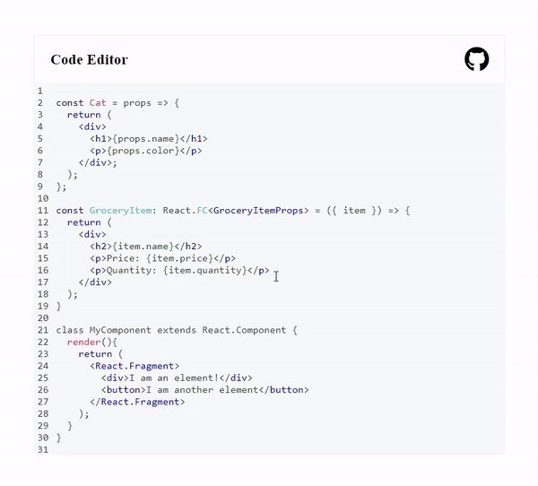

# Code Editor

Code Editor with syntax highlighting.

## Features

- Modular syntax highlighting with Prism JS
- Indent line or selected text by pressing tab key, with customizable indentation
- Automatic indent on new lines
- Code with Line Numbers
- Line Hightlighting

## Demo

[https://6682b4d2a469ba1c6bab624b--codeeditor8989.netlify.app/](https://6682b4d2a469ba1c6bab624b--codeeditor8989.netlify.app/)

## How it works

It works by overlaying a syntax highlighted `<pre>` block over a `<textarea>`. When you type, select, copy text etc., you interact with the underlying `<textarea>`, so the experience feels native.

`Highlight_Line` is Used For Line Highlighting  
`handlekey` is Used for the following key presses
- `Enter` Key
- `Backspace` Key
- `Tab` Key
- `ArrowDown` Key
- `ArrowUp` Key

